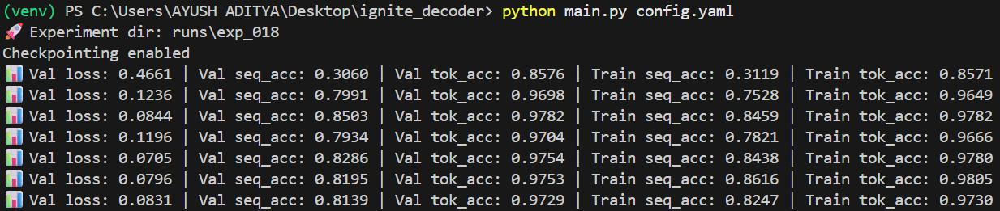
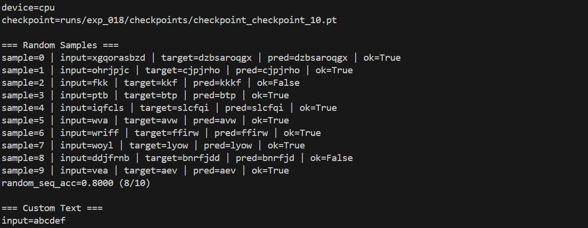

# 🔥 Decoder-Only Seq2Seq (Reverse String)

PyTorch + Ignite Implementation

A minimal, clean implementation of a decoder-only Transformer trained to reverse character sequences.

Built with PyTorch and PyTorch Ignite.

## Task

Given an input character sequence:

Input: `abcdef`  
Target: `fedcba`

The model learns to reverse the sequence using a decoder-only architecture.

## Training Formulation

This is implemented as a decoder-only sequence-to-sequence setup:

- The source sequence is used as prefix context
- The decoder input is:

	`[source_tokens] + [shifted_target_tokens]`

- Only target positions contribute to loss
- Causal masking is enabled
- Padding mask is enabled
- Loss = CrossEntropy with `ignore_index=pad_token_id`

This ensures the model:

- Conditions on the full source
- Predicts only the target
- Does not cheat using future tokens

## Architecture

Model: `DecoderOnlyTransformer`

Features:

- Sinusoidal positional encoding
- Transformer encoder layers (used as decoder backbone)
- Causal attention mask
- Padding mask (`src_key_padding_mask`)
- Cross-entropy loss
- Ignite-based trainer & evaluator

## 📂 Project Structure

```text
decoder-only-seq2seq/
│
├── config.yaml
├── main.py
├── predict.py
├── README.md
│
└── src/
		├── data/
		│   └── dataset.py
		├── models/
		│   └── decoder_transformer.py
		├── training/
		│   ├── trainer.py
		│   ├── evaluator.py
		│   ├── metrics.py
		│   ├── losses.py
		│   └── utils.py
		└── inference/
				└── generate.py
```

## Installation

Create environment:

```bash
python -m venv venv
```

Activate:

Windows

```bash
venv\Scripts\activate
```

Mac/Linux

```bash
source venv/bin/activate
```

Install dependencies:

```bash
pip install torch ignite pyyaml
```

## Training

Run:

```bash
python main.py config.yaml
```

Experiments are automatically saved to:

`runs/exp_XXX/`

Checkpoints are stored in:

`runs/exp_XXX/checkpoints/`

Each checkpoint file looks like:

`checkpoint_checkpoint_<N>.pt`

Example folder structure after training:

```text
runs/
└── exp_001/
		└── checkpoints/
				├── checkpoint_checkpoint_1.pt
				├── checkpoint_checkpoint_2.pt
				└── ...
```

## Typical Healthy Metrics

After ~10 epochs you should see something similar to:

- Val loss: ~0.03
- Val seq_acc: ~0.90+
- Val tok_acc: ~0.99
- Train seq_acc: ~0.90+
- Train tok_acc: ~0.99

### Why is sequence accuracy lower than token accuracy?

If:

- Token accuracy ≈ 0.99
- Average sequence length ≈ 8

Then:

`seq_acc ≈ 0.99^8 ≈ 0.92`

This matches observed behavior.

## 🔎 Inference (Checkpoint Test)

After training, run:

```bash
python predict.py --checkpoint runs/exp_XXX/checkpoints/checkpoint_checkpoint_10.pt --samples 10 --text abcdef
```

Replace `exp_XXX` with your experiment folder.

Example expected custom output:

```text
input=abcdef
target=fedcba
pred=fedcba
ok=True
```

Random unseen samples should also show high exact match once trained.

## 🖼 Example Training Output




##  What This Repo Demonstrates

✔ Proper decoder-only seq2seq conditioning  
✔ Correct teacher-forcing batch construction  
✔ Stable dataset sampling  
✔ Accurate masking (causal + padding)  
✔ Ignite-based training loop  
✔ End-to-end checkpoint validation

##  Repo Hygiene

Excluded from git:

- `runs/`
- `venv/`
- `__pycache__/`

No experiment artifacts are committed.

##  Possible Extensions

- Beam search decoding
- Sampling strategies
- Larger vocabularies
- Longer sequence tasks
- Algorithmic tasks (copy, addition, sorting)


## Summary

This repository provides a clean, minimal, reproducible example of training a decoder-only Transformer in a proper seq2seq formulation using PyTorch Ignite.

It can serve as:

- An educational reference
- A clean experimental baseline
- A starting point for larger generative experiments
